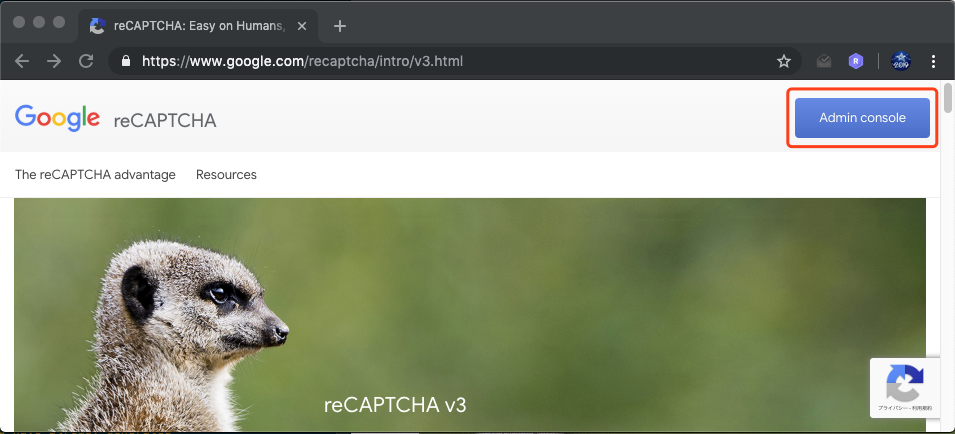
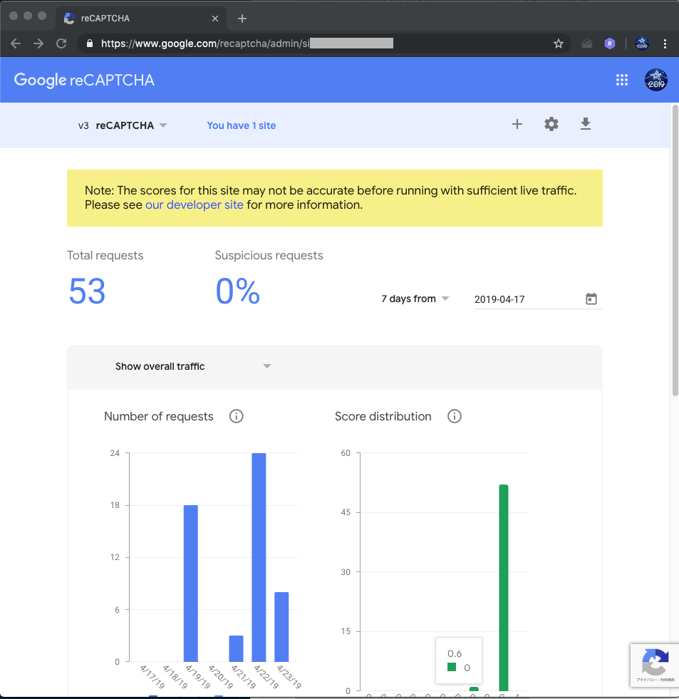
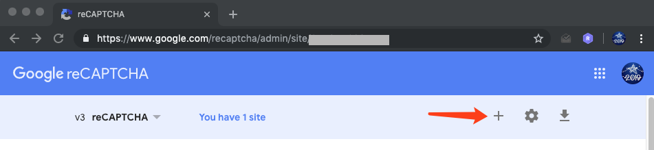
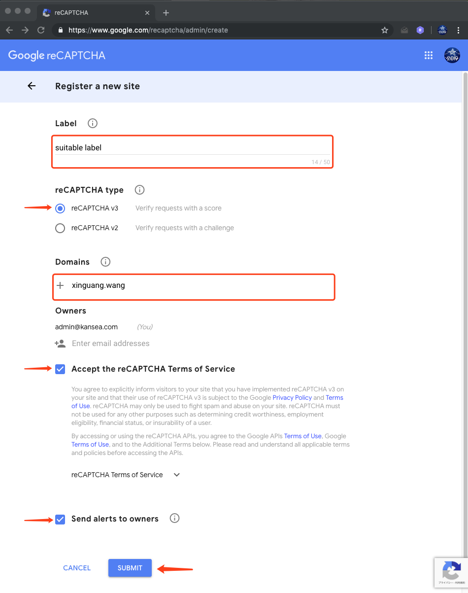
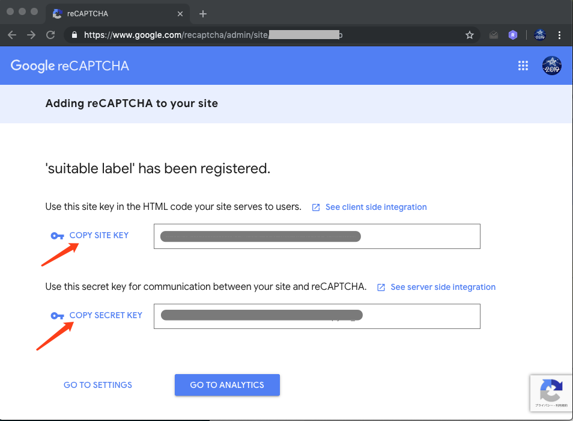

<pre align="center" type="ascii-art">
                                            _       _         
  __ _  ___        _ __ ___  ___ __ _ _ __ | |_ ___| |__   __ _ 
 / _` |/ _ \ _____| '__/ _ \/ __/ _` | '_ \| __/ __| '_ \ / _` |
| (_| | (_) |_____| | |  __/ (_| (_| | |_) | || (__| | | | (_| |
 \__, |\___/      |_|  \___|\___\__,_| .__/ \__\___|_| |_|\__,_|
 |___/                               |_|                       
</pre>

# reCaptcha

reCAPTCHA is a free service that protects your website from spam and abuse. reCAPTCHA uses an advanced risk analysis engine and adaptive challenges to keep automated software from engaging in abusive activities on your site. It does this while letting your valid users pass through with ease.

## Get Google reCaptcha Site Key And Secret Key

- Step 1. Go to Google reCaptcha platform to [CLICK HERE](https://www.google.com/recaptcha/intro/v3.html)
- Step 2. After opening Google reCaptcha website, click on “Admin Console” blue button at the top right side.
  
- Step 3. Sign In into your google account to proceed next into reCaptcha dashboard.
- Step 4. After Sign in, you will be redirected to your Google reCaptcha dashboard. If you have already generated reCaptcha keys than dashboard show stats about your previously created keys request.
  
- Step 5. To get new site key and secret key, click on “+” blue button top right side.
  
- Step 6. Register a new website form will open and you need to fill all the details correctly and submit the form.
  
- Step 7. After submitting the form you will get newly generated Site Key and Secret Key as below.
  

    Now, you can use the site and secret key in your app to configure the Google reCaptcha setting.
